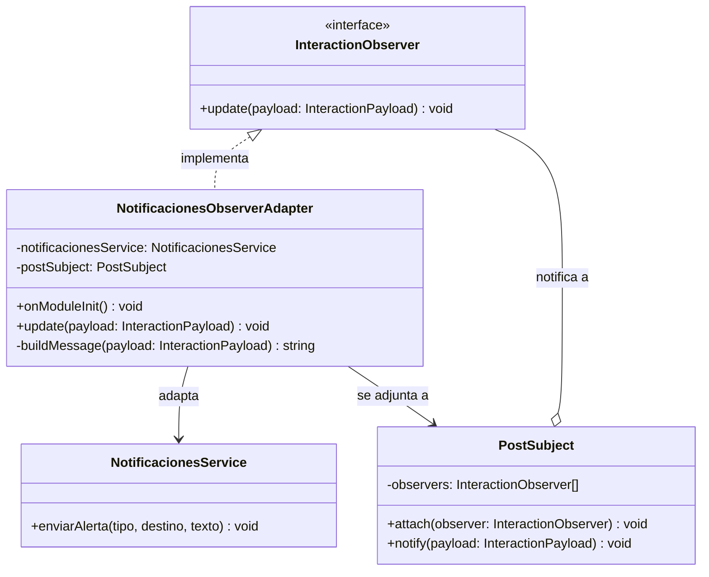
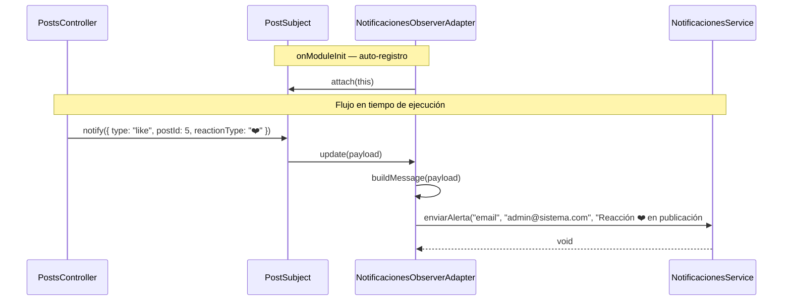
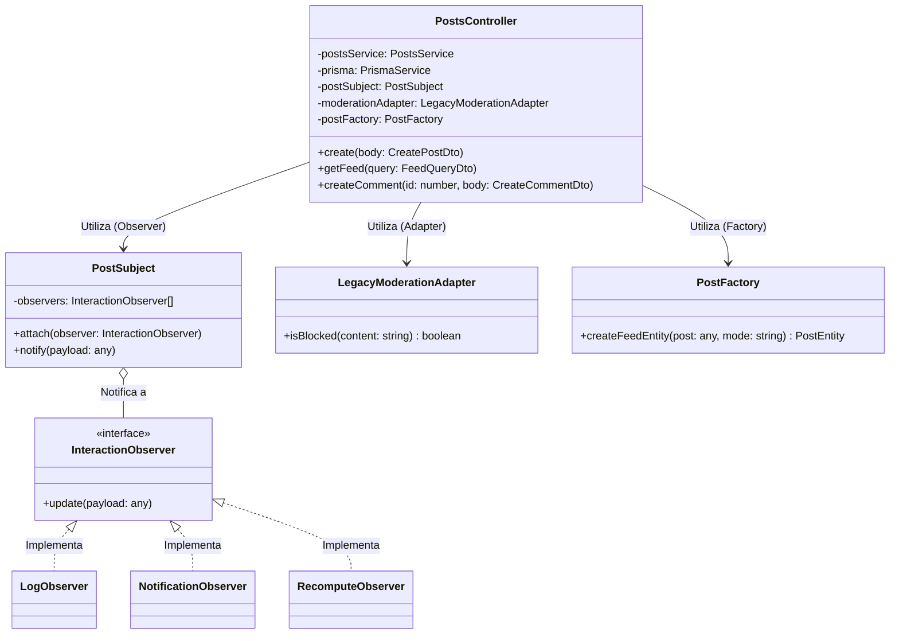

# Actividad 5: Patrones de Diseño y Código Limpio

## Información del Grupo

- **Repositorio Fork:** `jlevil2025-del/INFO1156-AC_05-Design-Patterns-GrupoOtraSeccion`
- **Integrantes:**
    - Bárbara Arriagada
    - Jaime Levil
    - Leonardo Chavez
    - Alan Bernales

---

## 1. Problemas Identificados (Diagnóstico Arquitectónico)

Al analizar el estado inicial del servidor en `src/posts/posts.controller.ts`, se detectaron severas falencias de arquitectura y violaciones a los principios de diseño de software:

- **Fat Controller (Controlador Saturado):** El controlador asumía responsabilidades de lógica de negocio profunda, cálculos matemáticos inline (método `getFeed`), y orquestación de efectos secundarios. Esto violaba flagrantemente el **Principio de Responsabilidad Única (SRP)**.
- **Acoplamiento Rígido en Efectos Secundarios:** Las funciones `logDomainEvent`, `fakeSendNotification` y `fakeRecomputeSomething` estaban acopladas inline dentro de los endpoints de creación, comentarios y likes. Agregar una nueva acción secundaria requería modificar directamente el controlador, violando el **Principio de Abierto/Cerrado (OCP)**.
- **Dependencia de Interfaces Inestables (Legacy Client):** El endpoint de comentarios interactuaba directamente con `legacyModerationApi.review()`, el cual retornaba tipos de datos inconsistentes (`string`, `number`, `object`). El controlador se veía obligado a implementar condicionales complejos (`if-else`) para normalizar la respuesta de esta API externa.

---

## 2. Patrones de Diseño Aplicados (Lógica del Servidor)

Para mitigar estos problemas, se implementaron soluciones puras en TypeScript aplicando tres categorías distintas de patrones de diseño, restringiendo su uso estrictamente a la lógica del servidor:

### A. Patrón Creacional: Factory (Fábrica)

- **Ubicación:** `src/posts/posts.factory.ts`
- **Solución:** Se delegó la instanciación compleja de `PostEntity` a la clase `PostFactory`. Toda la lógica de extracción de tags, cálculo de `relevanceScore` y mapeo de metadatos del _feed_ fue removida del controlador y centralizada en esta fábrica.
- **Impacto:** Cumple con SRP al aislar las reglas de construcción de entidades de presentación.
### Diagrama de Clases
Este diagrama muestra la estructura estática del módulo, ilustrando cómo el cliente (`NotificacionesService`) depende de la abstracción (`Notificacion`) y de la fábrica (`NotificacionFactory`), manteniéndose desacoplado de las implementaciones concretas.


### 🔄 Diagrama de Secuencia

Este diagrama describe el flujo dinámico cuando se solicita el envío de una alerta, demostrando cómo la fábrica intercepta la creación del objeto en tiempo de ejecución.


### Descripción de Componentes e Infraestructura
El patrón se divide en cuatro componentes clave ubicados en la ruta `src/notificaciones/`:

- **El Producto (`interfaces/notificacion.interface.ts`):** Define la interfaz `Notificacion` con el método abstracto `enviar`. Actúa como el contrato unificado del sistema.
- **Los Productos Concretos (`estrategias/`):** Clases `EmailNotificacion` y `WhatsappNotificacion`. Implementan de manera independiente la infraestructura técnica requerida para procesar y despachar los mensajes según su naturaleza.
- **El Creador (`notificacion.factory.ts`):** Clase `NotificacionFactory` que expone el método fábrica estático `crearCanal`. Centraliza las sentencias condicionales de instanciación evaluando el parámetro recibido en tiempo de ejecución.
- **El Servicio Cliente (`notificaciones.service.ts`):** Componente inyectable que encapsula la interacción con la fábrica y ejecuta los métodos del contrato abstracto, sirviendo como pasarela limpia para el resto de los módulos del servidor.

### Justificación de Diseño y Arquitectura

- **Desacoplamiento mediante Inversión de Dependencias:** El cliente (`NotificacionesService`) ya no depende de constructores directos (`new EmailNotificacion()`). Al depender exclusivamente de la interfaz abstracta, se reduce drásticamente el acoplamiento entre los componentes del sistema.
- **Extensibilidad bajo el Principio Abierto/Cerrado (OCP):** El código base está protegido contra modificaciones críticas. Si las necesidades del negocio exigen incorporar nuevos canales (como mensajería SMS, Telegram o notificaciones Push), solo se requiere codificar la nueva estrategia y registrarla en el switch de la fábrica. Toda la lógica de negocio consumidora permanecerá intacta.
- **Aislamiento de Responsabilidades (SRP):** La lógica asociada a discernir *cómo* y *cuándo* se inicializa un canal específico fue removida de las capas de servicio y encapsulada estrictamente en la fábrica creacional.
- **Modularidad para Integración en Repositorio:** El desarrollo se estructuró de forma encapsulada en su propio módulo (`NotificacionesModule`), permitiendo una integración limpia a través del árbol de directorios global y el mapeo de alias de rutas, minimizando la probabilidad de generar conflictos en el control de versiones al trabajar en paralelo con otros miembros del equipo.
### B. Patrón Estructural: Adapter (Adaptador)

Se identificaron **dos brechas de incompatibilidad de interfaces** en la arquitectura del servidor, ambas resueltas mediante el patrón Adapter.

---

#### B.1 — Adapter de Moderación: `LegacyModerationAdapter`

**Problema identificado**

El endpoint `POST /api/posts/:id/comments` necesitaba consultar al sistema de moderación para decidir si un comentario debía bloquearse. Sin embargo, el cliente de moderación disponible (`legacyModerationApi`) es un sistema heredado con una interfaz extremadamente inestable: su único método `review(content)` puede retornar tres tipos de datos completamente distintos según la regla interna que se active:

```
legacyModerationApi.review(content)
  → "BLOCK"              (string — contenido prohibido detectado)
  → "OK"                 (string — contenido aprobado)
  → 1                    (number — aprobado por regla numérica)
  → { pass: true, ... }  (object — aprobado por regla de objeto)
```

Consumir esta API directamente en el controlador obligaba a escribir una cadena de condicionales `if/else` con lógica de parseo dispersa, generando alta complejidad ciclomática y un acoplamiento frágil a los detalles de implementación del sistema externo.

**Solución aplicada**

Se definió la interfaz `ModernModerator` que establece el contrato limpio que el controlador necesita, y se implementó `LegacyModerationAdapter` como la clase adaptadora que traduce las respuestas heterogéneas del sistema legacy a ese contrato.

**Descripción de clases**

- **`ModernModerator` (interfaz — Target):** Define el contrato moderno esperado por el controlador. Expone un único método `isBlocked(content: string): boolean`, semántico y tipo-seguro.

- **`LegacyModerationAdapter` (clase — Adapter):** Implementa `ModernModerator` y encapsula internamente la llamada a `legacyModerationApi`. Normaliza los cuatro posibles tipos de retorno (`string "BLOCK"`, `string "OK"`, `number`, `object`) a un valor booleano unificado. Es inyectable mediante el sistema de DI de NestJS.

- **`legacyModerationApi` (objeto — Adapter):** El sistema heredado con interfaz inestable. No se modifica; el adaptador asume toda la responsabilidad de traducción.

**Resultado en el controlador**

```typescript
// Antes: 4 condicionales en el controlador
const result = legacyModerationApi.review(content);
if (result === 'BLOCK') throw ...
if (typeof result === 'number' && result < 1) throw ...
// ...

// Después: una sola línea limpia
if (this.moderationAdapter.isBlocked(body.content)) {
    throw new BadRequestException('Comment blocked by moderation');
}
```

**Ubicación:** `src/posts/moderation.adapter.ts` · `src/posts/legacy-moderation.client.ts`

---

#### B.2 — Adapter de Notificaciones: `NotificacionesObserverAdapter`

**Problema identificado**

El proyecto contaba con dos sistemas funcionales e independientes que nunca se comunicaban entre sí:

1. **El sistema Observer** (`posts.observer.ts`): emite eventos de interacción a través de la interfaz `InteractionObserver.update(payload: InteractionPayload)`. Su `NotificationObserver` concreto solo ejecutaba un `console.log`, sin enviar notificaciones reales.

2. **El sistema de Notificaciones** (`notificaciones/`): capaz de enviar alertas reales por email y WhatsApp mediante `NotificacionesService.enviarAlerta(tipo, destino, texto)`.

La brecha es estructural: las interfaces son **completamente incompatibles**.

```
Observer espera:      update(payload: InteractionPayload): void
                             └─ { type, postId, interactionId, reactionType? }

Notificaciones expone: enviarAlerta(tipo, destino, texto): void
                                    └─ "email" | "whatsapp", string, string
```

No existía ningún mecanismo para que un evento del Observer (`"like en post #5"`) se tradujera en una llamada al servicio de notificaciones. Además, `PostsModule` ni siquiera importaba `NotificacionesModule`, lo que dejaba todo el subsistema de alertas desconectado de la lógica de posts.

**Solución aplicada**

Se creó `NotificacionesObserverAdapter`, una clase que actúa como puente entre ambos sistemas sin modificar ninguno de ellos.

**Descripción de clases**

- **`NotificacionesObserverAdapter` (clase — Adapter):** Implementa `InteractionObserver`, por lo que es compatible con el sistema Observer y puede ser adjuntada a `PostSubject`. Internamente recibe `NotificacionesService` mediante inyección de dependencias y traduce cada `InteractionPayload` en una llamada a `enviarAlerta`. Utiliza el ciclo de vida `OnModuleInit` para auto-registrarse como observador en `PostSubject` sin necesidad de modificar el código existente del Observer.

- **`NotificacionesService` (clase existente — Adapter):** El servicio de notificaciones provisto por el módulo de notificaciones. No se modifica. El adapter asume la responsabilidad de mapear entre los dos mundos.

- **`InteractionObserver` (interfaz existente — Target):** El contrato que define el Observer pattern. El adapter lo implementa para ser transparente al sistema Observer.

**Diagrama de clases**



**Diagrama de secuencia**



**Ubicación:** `src/posts/notificaciones-observer.adapter.ts`

---

#### Justificación de Diseño y Arquitectura (Adapter)

- **Principio de Responsabilidad Única (SRP):** Cada adapter tiene una única responsabilidad: traducir entre dos interfaces. Ninguno contiene lógica de negocio ajena a esa traducción.

- **Principio de Abierto/Cerrado (OCP):** `LegacyModerationAdapter` permite cambiar o reemplazar el sistema de moderación legacy sin tocar el controlador. `NotificacionesObserverAdapter` conecta dos sistemas sin modificar ninguno de ellos.

- **Principio de Inversión de Dependencias (DIP):** El controlador depende de `ModernModerator` (abstracción), no de `legacyModerationApi` (implementación concreta). El Observer depende de `InteractionObserver` (abstracción), sin conocer que existe un servicio de notificaciones detrás.

- **Integración no invasiva:** `NotificacionesObserverAdapter` usa `OnModuleInit` para auto-registrarse en `PostSubject`, sin requerir modificaciones al código del Observer pattern. La única intervención en archivos existentes fue agregar las entradas de importación y proveedor en `posts.module.ts`.

### C. Patrón de Comportamiento: Observer (Observador Clásico)

- **Ubicación:** `src/posts/posts.observer.ts`
- **Solución:** Se diseñó una infraestructura nativa de Observer mediante interfaces (`InteractionObserver`) y un sujeto central (`PostSubject`). Los efectos secundarios de logging, notificaciones y recálculos de puntaje se desacoplaron en observadores independientes (`LogObserver`, `NotificationObserver`, `RecomputeObserver`).
  Para garantizar la Inversión de Dependencias (DIP), la instanciación de los observadores no utiliza la palabra clave new, sino que se delega al contenedor de Inyección de Dependencias (IoC) nativo de NestJS mediante el decorador @Injectable(). Esto permite que los observadores sean testeables y puedan recibir sus propias dependencias en el futuro.
- **Impacto:** El controlador ahora solo invoca a `this.postSubject.notify(...)`. Cumple al 100% con OCP; si el negocio exige un nuevo efecto (ej. auditoría o emails), basta con crear un nuevo observador e inscribirlo en el sujeto, sin alterar una sola línea del controlador existente.

---

## 3. Impacto en SOLID y Calidad de Código

| Principio                           | Estado Inicial                                                                                    | Estado Modificado con Patrones                                                                                             |
| :---------------------------------- | :------------------------------------------------------------------------------------------------ | :------------------------------------------------------------------------------------------------------------------------- |
| **SRP** (Responsabilidad Única)     | El controlador manejaba persistencia, moderación, logs, notificaciones y formateo.                | El controlador solo delega. La moderación va al **Adapter**, la creación al **Factory** y las alertas al **Observer**.     |
| **OCP** (Abierto / Cerrado)         | Modificar o añadir un log/notificación obligaba a reescribir los métodos del controlador.         | El controlador está cerrado a modificaciones. El sistema está abierto a extenderse mediante nuevos observadores concretos. |
| **DIP** (Inversión de Dependencias) | El controlador dependía directamente de una implementación concreta e inestable de la API legacy. | El controlador depende de la abstracción del adaptador inyectado por NestJS.                                               |

Todos los checks de compilación de TypeScript (`nest build`) pasan exitosamente en verde y la infraestructura de documentación (`/docs`) se mantiene completamente operativa y aislada.

## 4. Diagrama de Clases (Arquitectura del Servidor)


